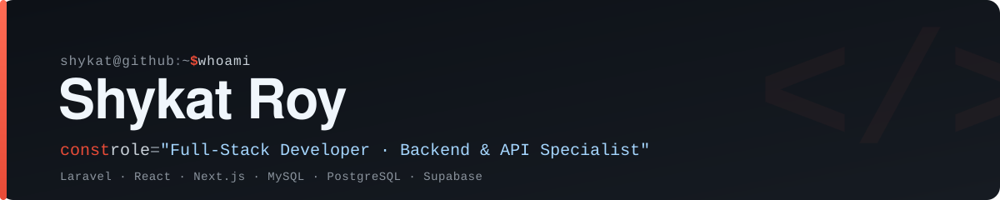

<div align="center">

<!-- Self-hosted banner — lives in this repo, no external service, never breaks -->


<br/><br/>

<a href="https://www.linkedin.com/in/shykat-roy/"></a>
<a href="https://github.com/shykat199"></a>
<a href="mailto:shykatroy.11815813@gmail.com"></a>

</div>

---

## 👨‍💻 About Me

I'm a **Full-Stack Developer** with **3+ years** of experience building scalable, high-performance web applications and **SaaS platforms**. I specialise in **backend development** — API design, database architecture, and server-side optimization — backed by strong frontend skills in **React.js** and **Next.js**.

I've shipped production platforms across **eCommerce** and **fintech**, and I bring **AI tools into my daily workflow** to prototype and ship faster. My systems don't just work — they work **fast, clean, and reliable.** 🚀

``` js
const shykat = {
  role: "Full-Stack Developer",
  focus: ["Backend Engineering", "API Design", "SaaS Products"],
  stack: { backend: ["Laravel", "PHP"], frontend: ["React", "Next.js"], db: ["MySQL", "PostgreSQL"] },
  Currently exploring: ["AI-assisted development", "Workflow automation (n8n)"],
  motto: "Build real things, learn relentlessly, ship faster.",
};
```

---

## 🛠️ What I Do

- 🔌 **API Development** — designing RESTful APIs that power web & mobile apps
- 🖥️ **Backend Engineering** — fast, clean, secure server-side systems
- 🌐 **Full-Stack Development** — end-to-end apps with Laravel, React & Next.js
- 🗄️ **Database Architecture** — optimized MySQL & PostgreSQL for high-traffic systems
- 🤖 **AI-Accelerated Workflows** — using AI tools & automation (n8n) to move faster
- ☁️ **Cloud Deployment** — AWS, cPanel & Vercel

---

## 💻 Tech Stack

<div align="center">


<br/><br/>

**Also working with:**
`CodeIgniter` · `Laravel Livewire` · `Laravel Passport` · `Spatie Permission` · `Strapi CMS` · `Eloquent ORM` · `REST APIs` · `AWS` · `cPanel`

</div>

---

## 🌟 Featured Projects

| Project | Description | Tech |
|---------|-------------|------|
| 🎓 **[CourseFinder](https://coursefinder.pfecglobal.com)** | Study-abroad SaaS platform for exploring institutions, courses, scholarships & destinations | `Laravel` `Next.js` `MySQL` |
| 🛒 **[Balaji Nuts & Spices](https://balajinutsandspices.com)** | eCommerce platform with GoFrugal & Zoho API integration for catalog, stock & orders | `Laravel API` `MySQL` |
| 📅 **[CalendarSync](https://calensync-woad.vercel.app)** | Unified calendar manager syncing Google & Outlook in one dashboard | `Next.js` `Supabase` |
| 💳 **Fatx.io / SRFMart** | Fintech & eCommerce backend — KYC, deposits, withdrawals, commissions & MLM hierarchy | `Laravel` `Passport` `Spatie` |
| 📋 **PM System & Ads Server** | Trello-like project management + ad campaign management with CPC/CPM reporting | `Laravel` `MySQL` `JS` |

---

## 📫 Let's Connect

<div align="center">

I'm always open to collaboration, interesting projects, and good conversations about building software.

<a href="https://www.linkedin.com/in/shykat-roy/"></a>
<a href="https://github.com/shykat199"></a>
<a href="mailto:shykatroy.11815813@gmail.com"></a>

<br/><br/>

<sub>⭐️ Building systems that just work · <a href="https://github.com/shykat199">@shykat199</a></sub>

</div>
